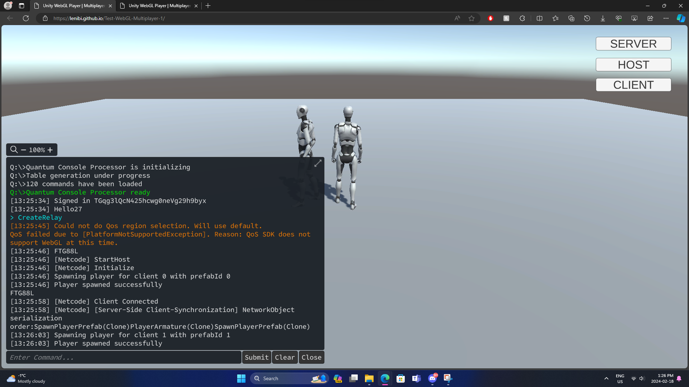
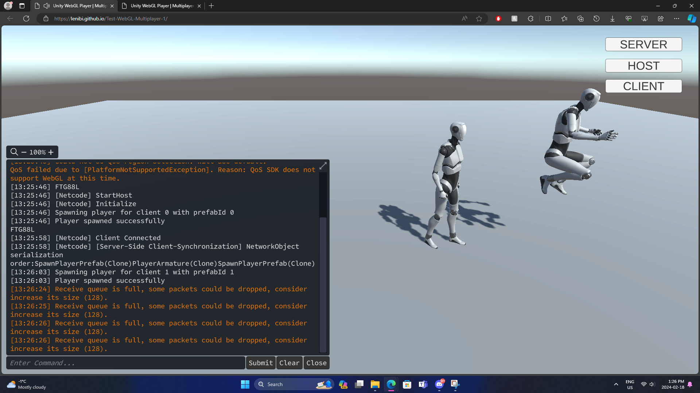

# Multiplayer Test1 WebGL
<a href="https://lenibi.github.io/Test-WebGL-Multiplayer-1/">Click Here To Play</a>
#### Please allow some loading time! Project may take from 5 seconds to a minute to load. 
Works best on a PC 1080p 16:9 screen.

## Description

Learning Unity multiplayer using Netcode for GameObjects, Relay, and Lobby. Testing if this also works when exporting to WebGL. Planning to make an online Monopoly multiplayer game.

## How to use

**The buttons are not used anymore, use the command line terminal**
* Open up two instances of the game (2 tabs), works on multiple computers online (not LAN)
* Tab1: Type "CreateRelay"
* Tab2: Type "JoinRelay codeYouGotInTab1"
* The two players are now linked together! Use WASD and spacebar to move around
* Can also use the lobby commands, such as CreateLobby, JoinLobbyByCode (code), or PrintPlayers, etc.
  
